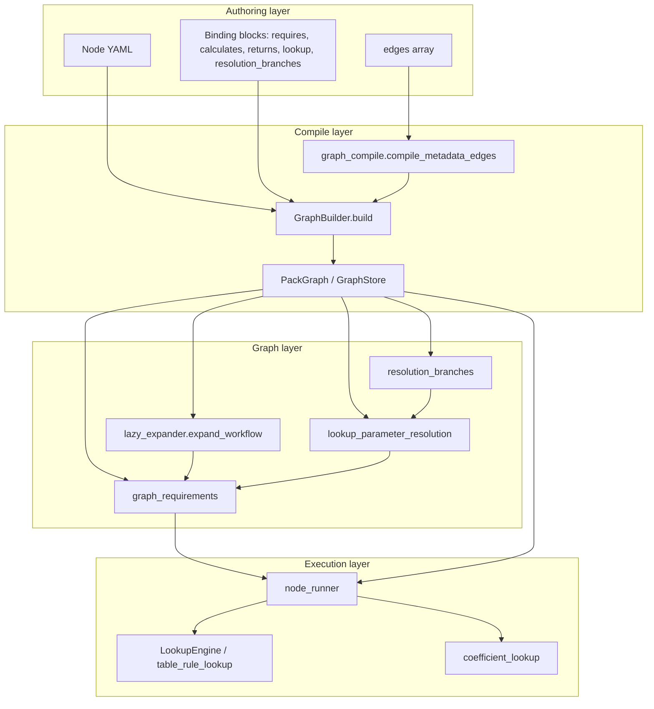

# Linkage Vocabulary and Runtime Ownership

**Phase:** 1 of incremental linkage audit  
**Date:** 2026-07-15  
**Scope:** Relationship fields, edge types, loaders, runtime consumers, validation, duplicate declarations, and confirmed inconsistencies. Does **not** inventory individual parameters, equations, tables, or workflows.

**Evidence labels used throughout:**

| Label | Meaning |
|-------|---------|
| **Confirmed** | Directly observed in cited production code and/or on-disk YAML |
| **Inferred** | Reasoned from code path without exhaustive YAML sweep |
| **Documented-only** | Stated in `audits/contracts/nodes/` but not verified at runtime in this phase |

---

## 1. Methodology

Inspected:

- Edge taxonomy and compile pipeline: [`engine/reference/relationship_taxonomy.py`](engine/reference/relationship_taxonomy.py), [`engine/reference/graph_edge_schema.py`](engine/reference/graph_edge_schema.py), [`engine/reference/graph_compile.py`](engine/reference/graph_compile.py)
- Graph build and PARAM injection: [`engine/graph/graph_builder.py`](engine/graph/graph_builder.py)
- Expansion and resolution: [`engine/graph/lazy_expander.py`](engine/graph/lazy_expander.py), [`engine/graph/lookup_parameter_resolution.py`](engine/graph/lookup_parameter_resolution.py), [`engine/graph/resolution_branches.py`](engine/graph/resolution_branches.py)
- Planner requirements: [`engine/planner/graph_requirements.py`](engine/planner/graph_requirements.py)
- Execution: [`engine/executor/node_runner.py`](engine/executor/node_runner.py), [`engine/executor/lookup_engine.py`](engine/executor/lookup_engine.py), [`engine/executor/table_rule_lookup.py`](engine/executor/table_rule_lookup.py), [`engine/executor/coefficient_lookup.py`](engine/executor/coefficient_lookup.py)
- Validators: [`engine/validation/*_node_validator.py`](engine/validation/), [`engine/reference/relationship_validator.py`](engine/reference/relationship_validator.py), [`engine/validation/lookup_rule_validator.py`](engine/validation/lookup_rule_validator.py)
- Representative YAML: [`PARAM-outside-diameter.yaml`](knowledge/global/parameters/nodes/PARAM-outside-diameter.yaml), [`asme-b313-304-1-2-eq-3a.yaml`](knowledge/standards/asme/asme_b31.3/nodes/equation/asme-b313-304-1-2-eq-3a.yaml), [`asme-b313-table-A-1.yaml`](knowledge/standards/asme/asme_b31.3/nodes/tables/asme-b313-table-A-1.yaml), [`asme-b3610-pipe-dimensions-lookup.yaml`](knowledge/standards/asme/asme_b31.3/nodes/lookups/asme-b3610-pipe-dimensions-lookup.yaml), [`asme-b313-table-302-3-3-1.yaml`](knowledge/standards/asme/asme_b31.3/nodes/tables/asme-b313-table-302-3-3-1.yaml), [`workflows/mawp.yaml`](workflows/mawp.yaml)
- Existing audit baseline: [`audits/reports/nodes/current-node-yaml-audit.md`](audits/reports/nodes/current-node-yaml-audit.md)

---

## 2. Relationship table

All stored graph relationships are **outgoing** from the declaring node unless noted. Reverse types (`required_by`, `dependency_of`, `used_by_lookup`, etc.) exist for **query only** and must not appear in authored YAML ([`graph_edge_schema.py:39-55`](engine/reference/graph_edge_schema.py)).

### 2.1 Universal edge container

| Field or edge type | Declared on | Target type | Direction | Runtime loader | Runtime consumer | Validation | Duplicate or fallback declarations |
| ------------------ | ----------- | ----------- | --------- | -------------- | ---------------- | ---------- | ---------------------------------- |
| `edges[]` | All knowledge node types | Any node id | Source → target | `GraphBuilder.build()` → `compile_metadata_edges()` ([`graph_compile.py:48-101`](engine/reference/graph_compile.py)) | `GraphStore`, `lazy_expander`, `lookup_parameter_resolution`, `graph_requirements`, `relationship_resolver` | `validate_edge_item()` per node validator; `validate_no_links_metadata()` forbids `links` | Deprecated top-level keys in `DEPRECATED_TOP_LEVEL_RELATIONSHIP_KEYS` ([`graph_edge_schema.py:147-175`](engine/reference/graph_edge_schema.py)) — not compiled by current `graph_compile.py` |
| `edges[].type` | Inside `edges` | — | — | `normalize_authoring_edge()` ([`relationship_taxonomy.py:376-418`](engine/reference/relationship_taxonomy.py)) | Type-specific consumers below | `RELATIONSHIP_RULES` ([`relationship_taxonomy.py:263-328`](engine/reference/relationship_taxonomy.py)) | Legacy `requires` → `requires_parameter`; legacy `references` + `role` → inferred taxonomy type |
| `edges[].target` | Inside `edges` | Node id | Outgoing | Same | Same | Target prefix rules in `RELATIONSHIP_RULES` | Aliases `to`, `node_id`, `id` accepted at parse ([`graph_edge_schema.py:77`](engine/reference/graph_edge_schema.py)) |
| `edges[].when` | Inside `edges` | — (metadata) | Gates traversal | Stored in compiled edge metadata via `relationship_metadata()` ([`graph_edge_schema.py:183-193`](engine/reference/graph_edge_schema.py)) | `when_clause_matches()` in [`conditions.py`](engine/graph/conditions.py); used in `lazy_expander._expand_metadata_dependencies`, `lookup_parameter_resolution.lookup_resolution_for_parameter` (lines 147-170), display filters | Allowed in `ALLOWED_EDGE_METADATA` | Separate `applicability.applies_when` dialect on nodes (see §2.8) |
| `edges[].alias` | Inside `edges` | — (metadata) | Symbol binding | Compiled edge metadata | `relationship_resolver.resolve_require_binding()` ([`relationship_resolver.py:65-92`](engine/graph/relationship_resolver.py)); equation execution | Allowed metadata key | Duplicates `requires[].symbol` on same nodes (e.g. [`asme-b313-304-1-2-eq-3a.yaml:42-59`](knowledge/standards/asme/asme_b31.3/nodes/equation/asme-b313-304-1-2-eq-3a.yaml)) |

### 2.2 Parameter traceability and ontology

| Field or edge type | Declared on | Target type | Direction | Runtime loader | Runtime consumer | Validation | Duplicate or fallback declarations |
| ------------------ | ----------- | ----------- | --------- | -------------- | ---------------- | ---------- | ---------------------------------- |
| `introduced_by` (top-level list) | `parameter` | Paragraph id | PARAM → paragraph | Compiled to `introduced_by` edge in `compile_metadata_edges()` ([`graph_compile.py:118-129`](engine/reference/graph_compile.py)) | `parameter_metadata.parameter_defined_in()`; `graph_requirements` incoming `introduced_by` | `validate_parameter_node()` — must be top-level, pack-qualified ([`parameter_node_validator.py:64-83`](engine/validation/parameter_node_validator.py)) | Paragraph `introduces_parameter` edges (paragraph → PARAM) are separate citation path |
| `introduces_parameter` (edge) | `paragraph` (nomenclature) | `PARAM-*` | Paragraph → PARAM | `edges[]` compile | `lazy_expander._expand_parameter_anchor_paragraphs()`; nomenclature traces | `paragraph_node_validator` — only allowed non-authority edge on nomenclature paragraphs | Same PARAM may also have `introduced_by` on PARAM node |
| `introduced_by` (edge on PARAM) | — | — | **Forbidden** | Not compiled from edges | — | `parameter_node_validator.py:80-83` rejects | Must use top-level list only |
| `used_by` (edge) | `parameter` | lookup / table / equation | PARAM → consumer | `edges[]` compile | `lookup_parameter_resolution` pairs with incoming `returns_parameter` when `when` present ([`lookup_parameter_resolution.py:155-170`](engine/graph/lookup_parameter_resolution.py)) | `RELATIONSHIP_RULES` traceability set | Conditional pairing required for some lookup resolutions |
| `has_dimension` (edge) | `parameter` | `DIM-*` | PARAM → dimension | `edges[]` compile | Unit compatibility, composer | `RELATIONSHIP_RULES` line 265 | Top-level `dimension: DIM-*` field also authored on PARAM nodes |
| `dimension` (top-level) | `parameter` | `DIM-*` | Field reference | `prepare_parameter_metadata()` in graph build | `parameter_metadata` readers | Parameter validator checks identity | Duplicates `has_dimension` edge |
| `has_concept` (edge) | `parameter` | `CONCEPT-*` | PARAM → concept | `edges[]` compile | `param_priority`, concept traversal | `RELATIONSHIP_RULES` line 264 | — |
| `resolves_via` (edge) | — | — | Taxonomy only | — | **Not used** on disk | Test forbids: [`test_parameter_ontology.py:215-216`](tests/reference/test_parameter_ontology.py) | Replaced by `resolution_branches` (see §2.4) |

### 2.3 Equation and validation binding blocks

| Field or edge type | Declared on | Target type | Direction | Runtime loader | Runtime consumer | Validation | Duplicate or fallback declarations |
| ------------------ | ----------- | ----------- | --------- | -------------- | ---------------- | ---------- | ---------------------------------- |
| `requires[]` | `equation`, `lookup`, `validation_rule` | `PARAM-*` (via `parameter` key) | Node consumes input | Loaded as YAML metadata (not auto-synced to edges at compile) | **Executor:** `node_runner._run_equation_node()` reads block directly ([`node_runner.py:1080-1083`](engine/executor/node_runner.py)); `resolve_requires_for_node()` prefers block over edges ([`relationship_resolver.py:112-114`](engine/graph/relationship_resolver.py)) | Equation / lookup / valrule validators | Matching `requires_parameter` edges on same nodes (dual-authored) |
| `requires_parameter` (edge) | equation, lookup, valrule, workflow, paragraph | `PARAM-*` | Source → PARAM | `edges[]` → `normalize_authoring_edge` | **Planner:** `_equation_input_fields()` ([`graph_requirements.py:198-206`](engine/planner/graph_requirements.py)); **Expansion:** `REQUIRES_TRAVERSAL_TYPES`; **Fallback resolver:** `node_requires_items()` if `requires[]` absent | `RELATIONSHIP_RULES` line 280 | Legacy `requires` edge type normalized to this |
| `calculates[]` | `equation` | `PARAM-*` | Node produces output | YAML metadata | Executor reads `calculates` for output mapping in equation run | Equation validator | `calculates_parameter` edges on same node |
| `calculates_parameter` (edge) | `equation` | `PARAM-*` | Equation → PARAM | `edges[]` compile | Planner `_equation_output_fields()`; `lazy_expander._expand_output_producers`; ordering via `calculates_parameter` incoming edges | Lookup forbidden: `calculates_parameter` on lookup rejected ([`lookup_node_validator.py:77-78`](engine/validation/lookup_node_validator.py)) | — |
| `returns[]` | `lookup` | `PARAM-*` | Lookup produces output | YAML metadata | `node_runner._run_lookup`; lookup resolution | `lookup_node_validator` lines 58-65 | `returns_parameter` edges |
| `returns_parameter` (edge) | `lookup` | `PARAM-*` | Lookup → PARAM | `edges[]` compile | `lookup_resolution_for_parameter` incoming traversal ([`lookup_parameter_resolution.py:141`](engine/graph/lookup_parameter_resolution.py)) | `RELATIONSHIP_RULES` line 288 | — |
| `validates[]` | `validation_rule` | `PARAM-*` | Rule checks outcome | YAML metadata | Documented for validation engine | `validation_rule_node_validator` lines 42-45 | `validates_parameter` edges |
| `validates_parameter` (edge) | `validation_rule` | `PARAM-*` | Rule → PARAM | `edges[]` compile | Expansion traversal; valrule validator | `RELATIONSHIP_RULES` line 296 | — |
| `constrains_equation` (edge) | `validation_rule` | `equation` | Rule → equation | `edges[]` compile | Documented applicability gate | `RELATIONSHIP_RULES` line 300 | — |
| `depends_on_equation` (edge) | `equation` | `equation` | Ordering | `edges[]` compile | Listed in `DEPENDENCY_TRAVERSAL_TYPES` ([`relationship_taxonomy.py:231`](engine/reference/relationship_taxonomy.py)) | Taxonomy rule line 216 | **Inferred:** implicit ordering also derived from shared `calculates_parameter` / `requires_parameter` via `_expand_equation_producer_ordering()` ([`lazy_expander.py:299-333`](engine/graph/lazy_expander.py)) |
| `authorized_by` (compiled edge) | `equation`, `lookup`, `validation_rule` | Paragraph id | Node → paragraph | Compiled from `authority.authorized_by` block ([`graph_compile.py:103-116`](engine/reference/graph_compile.py)) — **not** from `edges[]` | `lazy_expander`; provenance display | `authority_authorization.py`; forbidden in `edges` | Top-level `authority.authorized_by` is authoritative source |

### 2.4 Parameter resolution (non-edge)

| Field or edge type | Declared on | Target type | Direction | Runtime loader | Runtime consumer | Validation | Duplicate or fallback declarations |
| ------------------ | ----------- | ----------- | --------- | -------------- | ---------------- | ---------- | ---------------------------------- |
| `metadata.resolution_branches[]` / top-level `resolution_branches` | `parameter` | Branch specs | PARAM owns branches | YAML metadata via `prepare_parameter_metadata()` | `resolution_branches_from_metadata()` ([`resolution_branches.py:21-31`](engine/graph/resolution_branches.py)); `parameter_resolution_for_parameter()` ([`lookup_parameter_resolution.py:263-284`](engine/graph/lookup_parameter_resolution.py)); `apply_resolution_branch_defaults()` | Ontology tests; no dedicated edge validator | Deprecated `resolves_via` edges (unused) |
| `resolution_branches[].via_parameters[]` | Inside branch | `PARAM-*` | Branch → prerequisite PARAMs | YAML | `via_parameter_keys()` ([`resolution_branches.py:99-105`](engine/graph/resolution_branches.py)) | — | `requires_parameter` edges on lookups achieve similar gather semantics |
| `resolution_branches[].lookup` | Inside branch (`method: table_lookup`) | Lookup node id | Branch → lookup | YAML | `branch_table_lookup_resolution()` ([`resolution_branches.py:108-155`](engine/graph/resolution_branches.py)) | — | Graph `returns_parameter` edges also connect lookup → PARAM |
| `resolution_branches[].method` | Inside branch | `user_input` \| `table_lookup` | — | YAML | `parameter_resolution_for_parameter()` | — | — |
| `{key}__resolution_branch` (runtime fact) | Runtime Facts (not YAML) | Branch id string | User choice | Written by planner/bootstrap | `active_resolution_branch_id()` ([`resolution_branches.py:38-42`](engine/graph/resolution_branches.py)) | — | `metadata.default_value` seeds default branch ([`resolution_branches.py:52-69`](engine/graph/resolution_branches.py)) |
| `lookup_conditionals` | `parameter` (output PARAMs) | Input key rules | PARAM owns conditional lookup behavior | YAML metadata | `lookup_conditionals.py`; attached in `lookup_parameter_resolution` | — | Separate from edge `when` |
| `metadata.resolution` / `resolution` | `parameter` | Resolution spec | PARAM | YAML | `_explicit_resolution_from_metadata()` ([`lookup_parameter_resolution.py:82-104`](engine/graph/lookup_parameter_resolution.py)) | **Forbidden** top-level `resolution` on PARAM per validator ([`parameter_node_validator.py:33`](engine/validation/parameter_node_validator.py) — in `_FORBIDDEN_FIELDS`) | Branch model preferred for multi-path |

### 2.5 Lookup and table linkage

| Field or edge type | Declared on | Target type | Direction | Runtime loader | Runtime consumer | Validation | Duplicate or fallback declarations |
| ------------------ | ----------- | ----------- | --------- | -------------- | ---------------- | ---------- | ---------------------------------- |
| `lookup.table` / `lookup.table_id` | `lookup` node | Table id string | Lookup → table ref | YAML metadata | `_table_id_from_metadata()`; `node_runner._run_lookup` ([`node_runner.py:287-289`](engine/executor/node_runner.py)) | `lookup_node_validator` lines 49-56 | `reads_table` edge; `source.table_id` |
| `lookup.rule` | `lookup` node | Rule name in `lookup_rules` | — | YAML | `execute_table_rule_lookup()` via `LookupEngine.execute_rule_lookup()` | `validate_lookup_config()` | Legacy `lookup.lookup_rule` string (pre-v2) |
| `lookup.bindings` | `lookup` node | `PARAM-*` values keyed by logical input | Logical key → PARAM | YAML | `lookup_bindings()` ([`lookup_rule_schema.py`](engine/executor/lookup_rule_schema.py)); `node_runner._run_lookup` lines 255-277; `_lookup_keys_from_metadata()` | `lookup_rule_validator.validate_lookup_bindings()` | `inputs[]` block with `task_input_id`; legacy `lookup.keys` |
| `lookup.keys` + `lookup_rule` | `lookup` (legacy) | Column names | — | YAML | **Not consumed** by v2 `table_rule_lookup` | Passes `validate_lookup_node` for `asme-b313-table-302-3-3-1` | v2 uses `lookup_rules` + `lookup.rule` + `bindings` |
| `lookup_rules` | Lookup node frontmatter **or** table data YAML (e.g. `B3610-table-2-1.yaml`) | Strategy specs | Table owns rules | `load_table_lookup_rules()` ([`lookup_rule_schema.py`](engine/executor/lookup_rule_schema.py)) via `_table_yaml_candidates()` | `execute_table_rule_lookup()` → `lookup_rule_strategies` | `validate_lookup_rule_spec()` | Rules co-located on B31.3 lookup nodes **and** in B36.10 data YAML |
| `inputs[]` | `lookup`, equation sidecars | Runtime fact keys (`id`, `task_input_id`) | Input descriptor | YAML | `node_runner` when bindings absent; `DependencyValidator` for `source: node_output` | Implicit via lookup validator | `lookup.bindings` preferred in v2 |
| `reads_table` (edge) | `lookup` | Table node id | Lookup → table | `edges[]` compile | Graph expansion | `RELATIONSHIP_RULES` line 292 | `lookup.table` field |
| `source.pack`, `source.yaml`, `source.tables_db`, `source.table_id` | `lookup` | External pack paths | Pack linkage | YAML | `table_rule_lookup`, `StandardsTablesDatabase`, `PipeDimensionsDatabase` | Revision metadata | Hardcoded path candidates in `table_options_resolver._table_yaml_candidates()` |
| `notes[].node_id` | `lookup` | `table_note` node | Lookup → note | YAML | Table-note edge validation | `lookup_node_validator._validate_table_note_edges` | `has_table_note` / `note_for_table` edges |
| `lookups[]` (legacy array) | ASTM nodes (`A106.yaml`, etc.) | Nested lookup configs | — | YAML | `node_runner` falls back if `lookup` block absent ([`node_runner.py:242-247`](engine/executor/node_runner.py)); `MaterialPropertiesLookup` | **Fails** current `validate_lookup_node` per audit | v2 single `lookup` block |

### 2.6 Workflow linkage

| Field or edge type | Declared on | Target type | Direction | Runtime loader | Runtime consumer | Validation | Duplicate or fallback declarations |
| ------------------ | ----------- | ----------- | --------- | -------------- | ---------------- | ---------- | ---------------------------------- |
| `entry_points[]` | `workflow` | `PARAM-*` or paragraph (`role: definition_anchor`) | Workflow → anchor | YAML; workflow pack discovery in `graph_builder` | `workflow_anchor_target()` ([`graph_edge_schema.py:224-254`](engine/reference/graph_edge_schema.py)) | `workflow_node_validator` | Forbidden: `starts_from_paragraph` / `starts_from_parameter` edges ([`workflow_node_validator.py:87-90`](engine/validation/workflow_node_validator.py)) |
| `expected_parameters[]` | `workflow` | `PARAM-*` | Anticipatory list | YAML; triggers `_collect_param_references()` ([`graph_builder.py:175-176`](engine/graph/graph_builder.py)) | Global PARAM injection into pack graph | Workflow validator | Graph expansion is authoritative for actual asks per graph-expansion rules |
| `expected_authorities[]` | `workflow` | `AUTH-*` | Workflow → authority | YAML | Authority context bootstrap | Workflow validator | `uses_authority` / `may_use_authority` edges |
| `goal_expansion.root_goal.target_parameter` | `workflow` | `PARAM-*` | Goal anchor | YAML | `workflow_goal_metadata`, planner completion | `validate_workflow_goal_anchor` | — |
| `may_use_equation` (edge) | `workflow` | Equation id | Workflow → equation (eligibility) | `edges[]` | `lazy_expander` expansion from workflow | `RELATIONSHIP_RULES` line 317 | `references_equation` on paragraphs (citation, not eligibility) |
| `may_use_lookup` (edge) | `workflow` | Lookup id | Workflow → lookup | `edges[]` | Expansion | Line 318 | — |
| `may_use_validation_rule` (edge) | `workflow` | Valrule id | Workflow → valrule | `edges[]` | Expansion | Line 319 | — |
| `requires_parameter` (edge on workflow) | `workflow` | `PARAM-*` | Workflow expects input | `edges[]` | Expansion / requirements | Line 280 | `runtime.navigation.phases` in workflow sidecar (phase order only) |
| `depends_on` (edge on workflow) | `workflow` | lookup/table/node | Structural dep | `edges[]` | `DEPENDENCY_TRAVERSAL_TYPES` | Structural edge rules | Top-level `depends_on[]` on legacy nodes |
| `applicability.applies_to` | `workflow` | `CONCEPT-*` | Workflow scope | YAML metadata | Workflow applicability checks | Workflow validator | — |

### 2.7 Paragraph structure and citations

| Field or edge type | Declared on | Target type | Direction | Runtime loader | Runtime consumer | Validation | Duplicate or fallback declarations |
| ------------------ | ----------- | ----------- | --------- | -------------- | ---------------- | ---------- | ---------------------------------- |
| `hierarchy.parent` / `hierarchy.children` | `paragraph` | Paragraph section ids | Tree metadata | YAML (not edges) | Standards browser navigation | `structural_edges.validate_no_structural_edges` — no `parent`/`child` in `edges` | — |
| `references_equation` | `paragraph`, `workflow` | Equation id | Citation | `edges[]` | Display / trace | `RELATIONSHIP_RULES` line 306 | Equation `authorized_by` is separate |
| `references_lookup` / `references_table` / `references_validation_rule` | `paragraph`, `workflow` | Node ids | Citation | `edges[]` | Display / expansion hints | Lines 307-309 | — |
| `related_to` | `paragraph` | Paragraph id | Cross-cite | `edges[]` | Navigation | Paragraph validator | Must not replace `hierarchy` |
| `applicability.applies_when` | paragraph, equation, lookup | `PARAM-*` or fact fields | Node activation gate | YAML | `assumption_checker.applicability_expansion_satisfied`; `lazy_expander._node_active_on_path` | Paragraph placement policy | Edge-level `when` uses same `when_clause_matches` but different declaration site |

### 2.8 Embedded containers and sidecars

| Field or edge type | Declared on | Target type | Direction | Runtime loader | Runtime consumer | Validation | Duplicate or fallback declarations |
| ------------------ | ----------- | ----------- | --------- | -------------- | ---------------- | ---------- | ---------------------------------- |
| `assumptions[]`, `interactions[]` | Paragraph / workflow runtime (sidecar) | Fact fields / pseudo-parameters | Gate fields | `merge_paragraph_sidecar_metadata`, workflow sidecar merge | `node_interaction.load_node_interactions`; `expansion_policy` gates | Workflow forbids in frontmatter ([`workflow_node_validator.py:37-38`](engine/validation/workflow_node_validator.py)) | — |
| `equations[]`, `inputs[]`, `outputs[]` | Paragraph/table embedded metadata | Child node specs | Container → embedded | `iter_embedded_node_sources()` ([`embedded_nodes.py`](engine/reference/embedded_nodes.py)) | Legacy compile path; embedded equations as first-class nodes | Embedded type defaults lines 33-44 | Flat equation files are canonical for B31.3 |
| `item.source` (sidecar path) | Embedded items | External YAML path | Pointer | `embedded_nodes.py:77-80` | Loads external node file | — | — |

### 2.9 Authority, unit, and non-graph nodes

| Field or edge type | Declared on | Target type | Direction | Runtime loader | Runtime consumer | Validation | Duplicate or fallback declarations |
| ------------------ | ----------- | ----------- | --------- | -------------- | ---------------- | ---------- | ---------------------------------- |
| `belongs_to_authority` (edge) | `paragraph`, `table` | `AUTH-*` | Node → authority | `edges[]` | Pack structure | `RELATIONSHIP_RULES` line 271 | — |
| `converts_to` (edge) | `unit` | `UNIT-*` + `factor`/`equation` | Unit conversion | `edges[]` | `unit_resolver`, `unit_manager` | `unit_node_validator` | Conversion equations under `knowledge/global/units/nodes/equation/` |
| `material_catalog` node | `MAT-catalog.yaml` | Material registry | **Non-canonical** | **Outside** `GraphBuilder` — direct file load | `nomenclature_resolver._load_material_catalog_node()`; `lookup_rule_resolvers.material_catalog` | **No validator** (audit WARN) | `resolution.method: material_catalog` on PARAM nodes |

---

## 3. Source-of-truth table

| Relationship category | Current authoritative source | Other declarations | Runtime fallback | Hardcoded behavior |
| --------------------- | ---------------------------- | ------------------ | ---------------- | ------------------ |
| **Parameter introduction** | Top-level `introduced_by` on `PARAM-*` (compiled to edge) | Paragraph `introduces_parameter` edges | — | — |
| **Parameter resolution (multi-path)** | `metadata.resolution_branches` on anchor `PARAM-*` | — | `default_value` branch id | Hardcoded lookup node constants in [`lookup_resolution_service.py`](engine/graph/lookup_resolution_service.py): `OUTSIDE_DIAMETER_LOOKUP_NODE`, `WALL_THICKNESS_LOOKUP_NODE` |
| **Parameter resolution (single-path)** | Incoming `returns_parameter` from active lookup + `used_by` pairing | `resolution_branches[].lookup` | `_explicit_resolution_from_metadata()` if present | `material_catalog` resolver bypasses graph |
| **Parameter usage traceability** | `used_by` edges on `PARAM-*` | Consumer `requires_parameter` edges | — | — |
| **Runtime fact key** | `key` field on `PARAM-*` node | `aliases` in PARAM metadata; `LEGACY_PARAMETER_KEY_ALIASES` in [`parameter_keys.py:22-30`](engine/reference/parameter_keys.py) | `canonical_parameter_key()` at read time | `_PARAM_TO_FIELD` map in `workflow_sidecar` |
| **Equation inputs** | **Split:** `requires[]` block for **executor**; `requires_parameter` **edges** for **planner/expansion** | `edges[].alias` | `node_requires_items()` reads edges only if `requires[]` absent ([`relationship_resolver.py:112-114`](engine/graph/relationship_resolver.py)) | — |
| **Equation outputs** | `calculates[]` block (executor) + `calculates_parameter` edges (planner) | — | — | — |
| **Equation ordering** | Implicit via `_expand_equation_producer_ordering()` on `calculates_parameter` → `requires_parameter` chains | `depends_on_equation` edges (authored rarely) | Synthetic `requires` edges added at expansion time ([`lazy_expander.py:321-332`](engine/graph/lazy_expander.py)) | — |
| **Workflow-to-node linkage** | `entry_points`, `goal_expansion`, `may_use_*` edges on workflow node | `expected_parameters` (injection only) | `resolve_workflow_node_id()` slug map in [`workflow_adapters.py`](engine/graph/workflow_adapters.py) | `_maybe_emit_diameter_resolution()` overlay in planner ([`graph_requirements.py:500+`](engine/planner/graph_requirements.py)) |
| **Lookup input bindings** | `lookup.bindings` (v2) | `inputs[]` descriptors; legacy `lookup.keys` | `node_runner` maps `material`↔`material_grade`, `temperature`→`design_temperature` when bindings absent ([`node_runner.py:279-285`](engine/executor/node_runner.py)) | — |
| **Lookup output bindings** | `returns[]` + `returns_parameter` edges | — | `execute_rule_lookup(returns=...)` mapping | — |
| **Table selection** | `lookup.table` on lookup node | `reads_table` edge; `source.table_id` | `_GRAPH_NODE_TABLE_IDS` maps in [`lookup_engine.py:66-69`](engine/executor/lookup_engine.py) and [`table_rule_lookup.py:28-34`](engine/executor/table_rule_lookup.py) | `_table_yaml_candidates()` hardcoded paths |
| **Lookup strategy** | `lookup_rules` in table YAML or co-located on lookup node; selected by `lookup.rule` | Legacy `lookup_rule` string | `RULE_NAME_ALIASES` in `lookup_rule_schema` | `LookupEngine.lookup()` dispatches by table id string ([`lookup_engine.py:167-200`](engine/executor/lookup_engine.py)) |
| **Table row data** | SQLite: `asme_b313_tables.db`, `pipe_dimensions.db` | Table/lookup YAML (rules only for B31.3) | YAML fallback in `PipeDimensionLookup` | Rows embedded in [`scripts/build_standards_tables_db.py`](scripts/build_standards_tables_db.py) |
| **Validation-rule invocation** | `validates[]` / `validates_parameter` edges (authored) | `constrains_equation` edges | **No execution:** `NodeRunner` skips valrules ([`node_runner.py:125-129`](engine/executor/node_runner.py)); `Executor` marks completed without run ([`executor.py:167-169`](engine/executor/executor.py)) | — |
| **Applicability** | `applicability.applies_when` on node metadata | `edges[].when`; workflow `applicability.applies_to` | Expansion gates from `expansion_policy` | — |

---

## 4. Confirmed findings

Each finding is tagged **Active** (breaks or bypasses an in-use workflow path today), **Structural** (competing paths or dual declarations that are dormant or partially used), or **Cleanup** (authoring/validator hygiene).

### LINK-VOC-001 — Equation inputs: executor reads `requires[]` block; planner reads `requires_parameter` edges

* **Severity:** architectural ambiguity — **Structural** (dual declaration; nodes currently keep both in sync manually)  
* **Files:** [`engine/executor/node_runner.py:1080-1083`](engine/executor/node_runner.py), [`engine/planner/graph_requirements.py:198-206`](engine/planner/graph_requirements.py), [`knowledge/standards/asme/asme_b31.3/nodes/equation/asme-b313-304-1-2-eq-3a.yaml`](knowledge/standards/asme/asme_b31.3/nodes/equation/asme-b313-304-1-2-eq-3a.yaml)  
* **Declarations involved:** Dual `requires[]` (lines 13–37) and `requires_parameter` edges (lines 42–59) on the same equation.  
* **Runtime interpretation:** `_run_equation_node` calls `resolve_require_bindings(store, requires)` on the **block only** — it does not call `resolve_requires_for_node()` which would fall back to edges. Planner `_equation_input_fields` walks **edges only**.  
* **Why they conflict:** If the two declarations diverge, planner expansion and executor binding can disagree on inputs. Today they are kept in sync manually.  
* **Validator detection:** Equation validator checks block shape; edge validator checks edges separately — **no cross-equality check**.

### LINK-VOC-002 — `LookupEngine.lookup()` hardcodes B36.10 to `by_nps` only

* **Severity:** error on shortcut path — **Structural** (not used by active MAWP pipe-dimension path; see §8.1)  
* **Files:** [`engine/executor/lookup_engine.py:191-200`](engine/executor/lookup_engine.py), [`asme-b3610-pipe-dimensions-lookup.yaml:29-31`](knowledge/standards/asme/asme_b31.3/nodes/lookups/asme-b3610-pipe-dimensions-lookup.yaml)  
* **Declarations involved:** Lookup node declares `rule: by_nps_schedule`. `LookupEngine.lookup()` always calls `rule="by_nps"` for B36.10 table refs.  
* **Runtime interpretation:** `_run_micro_lookup` and `_resolve_table_lookup_parameter` use `LookupEngine.lookup()` shortcut path.  
* **Why they conflict:** Authored metadata specifies schedule rule; shortcut path ignores it.  
* **Validator detection:** **None** for runtime shortcut consistency.

### LINK-VOC-003 — Duplicated incomplete `_GRAPH_NODE_TABLE_IDS` maps

* **Severity:** warning  
* **Files:** [`engine/executor/lookup_engine.py:66-69`](engine/executor/lookup_engine.py) (2 entries), [`engine/executor/table_rule_lookup.py:28-34`](engine/executor/table_rule_lookup.py) (5 entries)  
* **Declarations involved:** Graph node id → canonical table id mapping.  
* **Runtime interpretation:** `_resolve_table_ref()` in each module uses its local map.  
* **Why they conflict:** Different modules resolve the same node ids differently; incomplete map in `lookup_engine` may leave refs unresolved in shortcut path.  
* **Validator detection:** **None**.

### LINK-VOC-004 — Legacy lookup shape on `asme-b313-table-302-3-3-1` not consumed by v2 pipeline

* **Severity:** error (if this lookup is invoked via v2 path)  
* **Files:** [`knowledge/standards/asme/asme_b31.3/nodes/tables/asme-b313-table-302-3-3-1.yaml:32-36`](knowledge/standards/asme/asme_b31.3/nodes/tables/asme-b313-table-302-3-3-1.yaml), [`engine/executor/table_rule_lookup.py`](engine/executor/table_rule_lookup.py)  
* **Declarations involved:** `lookup.keys` + `lookup_rule: examination_combination` — no `lookup_rules`, no `lookup.bindings`.  
* **Runtime interpretation:** v2 `execute_table_rule_lookup()` loads rules via `load_table_lookup_rules()` expecting `lookup_rules` block.  
* **Why they conflict:** Node passes `validate_lookup_node` but v2 executor cannot load strategy.  
* **Validator detection:** `validate_lookup_node` passes; `validate_lookup_config` only runs when `lookup` dict present with v2 shape — **partial**.

### LINK-VOC-005 — Parallel coefficient resolution bypasses lookup nodes

* **Severity:** architectural ambiguity — **Active** (MAWP coefficient path uses `coefficient_lookup`, not lookup nodes; see §8.3)  
* **Files:** [`engine/executor/coefficient_lookup.py:8-13`](engine/executor/coefficient_lookup.py), [`knowledge/standards/asme/asme_b31.3/nodes/tables/asme-b313-table-A-3.yaml`](knowledge/standards/asme/asme_b31.3/nodes/tables/asme-b313-table-A-3.yaml) (v2 `lookup_rules` confirmed on co-located nodes)  
* **Declarations involved:** Table nodes A-2, A-3, 304-1-1-1, 302-3-5-1 have v2 `lookup_rules`; `coefficient_lookup` calls `coefficient_resolver` with hardcoded table id constants.  
* **Runtime interpretation:** Two pipelines can produce E_j, W, Y facts — graph-driven `execute_rule_lookup` vs `apply_coefficient_lookups`.  
* **Why they conflict:** Authored lookup metadata is not the sole runtime path for these coefficients.  
* **Validator detection:** **None** for path exclusivity.

### LINK-VOC-006 — `introduced_by` pack-qualification failures on multiple PARAM nodes

* **Severity:** error  
* **Files:** [`engine/validation/parameter_node_validator.py:66-68`](engine/validation/parameter_node_validator.py), [`audits/reports/nodes/current-node-yaml-audit.md:70-71,72,89`](audits/reports/nodes/current-node-yaml-audit.md)  
* **Declarations involved:** Bare paragraph ids e.g. `304.1.2-a`, `304.1.3` in `introduced_by` on `PARAM-inside-diameter`, `PARAM-external-design-pressure`, `PARAM-thin-wall-applicability`.  
* **Runtime interpretation:** `compile_metadata_edges` still compiles refs; graph may resolve via `resolve_pack_node_ref`.  
* **Why they conflict:** Validator FAIL vs possible runtime tolerance.  
* **Validator detection:** **Yes** — `validate_parameter_node` and audit script.

### LINK-VOC-007 — PARAM id/key slug case mismatch

* **Severity:** error  
* **Files:** [`audits/reports/nodes/current-node-yaml-audit.md:88-91`](audits/reports/nodes/current-node-yaml-audit.md), [`engine/reference/parameter_keys.py`](engine/reference/parameter_keys.py)  
* **Declarations involved:** `PARAM-temperature-coefficient-Y`, `PARAM-weld-strength-reduction-factor-W` — validator expects lowercase slug in id/key.  
* **Runtime interpretation:** Facts use `key` field; uppercase `Y`/`W` in id may still work if `key` is lowercase.  
* **Why they conflict:** Identity contract violated at validation layer.  
* **Validator detection:** **Yes** — `validate_parameter_identity_fields`.

### LINK-VOC-008 — `material_catalog` outside canonical node registry

* **Severity:** architectural ambiguity  
* **Files:** [`knowledge/global/materials/nodes/MAT-catalog.yaml`](knowledge/global/materials/nodes/MAT-catalog.yaml), [`engine/reference/node_types.py:7-24`](engine/reference/node_types.py), [`audits/reports/nodes/current-node-yaml-audit.md:61`](audits/reports/nodes/current-node-yaml-audit.md)  
* **Declarations involved:** `type: material_catalog` — not in `CANONICAL_NODE_TYPES`.  
* **Runtime interpretation:** Loaded by dedicated loaders; `material_catalog` input resolver in v2 lookup rules.  
* **Why they conflict:** Relationship to graph edges is ad hoc, not `GraphBuilder`-compiled.  
* **Validator detection:** Audit WARN only.

### LINK-VOC-009 — Validation rules skipped at execution

* **Severity:** functional gap — **Active** (authored valrules never evaluated; see §8.4)  
* **Files:** [`engine/executor/node_runner.py:125-129`](engine/executor/node_runner.py), [`engine/executor/executor.py:167-169`](engine/executor/executor.py)  
* **Declarations involved:** `validates_parameter` / `validates[]` on valrule nodes.  
* **Runtime interpretation:** Valrules never executed in node loop; marked complete without evaluation.  
* **Why they conflict:** Authored validation linkage is not consumed by primary execution path.  
* **Validator detection:** **None** for execution wiring.

### LINK-VOC-011 — `apply_allowable_stress_lookup` passes wrong v2 input key

* **Severity:** error — **Active** (MAWP replanning path; see §8.2)  
* **Files:** [`engine/executor/allowable_stress_resolver.py:59-67`](engine/executor/allowable_stress_resolver.py)  
* **Declarations involved:** Lookup node `asme-b313-table-A-1` rule `by_material_temperature` expects logical input `material_grade` ([`lookup_rule_schema.py:39`](engine/executor/lookup_rule_schema.py)); resolver passes `"material": material`.  
* **Runtime interpretation:** `execute_rule_lookup` → `resolve_input_value` raises `material_grade is required for table lookup`. `node_runner._run_lookup` aliases `material` ↔ `material_grade` ([`node_runner.py:280-283`](engine/executor/node_runner.py)); `allowable_stress_resolver` does not.  
* **Why they conflict:** Same v2 pipeline, different input-key contract at call site.  
* **Evidence:** `tests/planner/test_goal_resolver.py::test_resolve_ready_goals_applies_allowable_stress_when_prerequisites_exist` **fails** with this error; direct call with `material_grade` key succeeds (§8.2).  
* **Validator detection:** **None**.

### LINK-VOC-010 — ASTM lookup nodes fail validator but remain on disk

* **Severity:** error  
* **Files:** [`audits/reports/nodes/current-node-yaml-audit.md:168-171`](audits/reports/nodes/current-node-yaml-audit.md), [`knowledge/standards/astm/nodes/A106.yaml`](knowledge/standards/astm/nodes/A106.yaml)  
* **Declarations involved:** Legacy `lookups[]`, `introduces_parameter` from lookup type, missing `returns` / `lookup.table`.  
* **Runtime interpretation:** `MaterialPropertiesLookup` separate path (**inferred**).  
* **Why they conflict:** Node shape contradicts current lookup contract.  
* **Validator detection:** **Yes** — `validate_lookup_node` FAIL in audit.

---

## 5. Runtime ownership diagram (confirmed)

**Key boundary:** Binding blocks stay as node metadata on `GraphNodeRecord`; only `edges[]`, `introduced_by`, and `authority.authorized_by` become compiled `GraphEdgeRecord` entries.

---

## 6. Recommended order of work (updated after runtime trace)

Aligned with owner assessment. **Do not refactor lookup consolidation until traces below are accepted.**

| Step | Action | Status after §8 trace |
|------|--------|----------------------|
| 1 | Trace three representative lookup executions | **Done** — §8.1–8.3 |
| 2 | Verify whether validation-rule nodes actually run | **Done** — §8.4 |
| 2a | Fix `apply_allowable_stress_lookup` input-key bug (`LINK-VOC-011`) | **Active blocker** for `resolve_ready_goals` |
| 3 | Decide valrule runtime role; wire execution if checks are intended | **Blocked** until product decision |
| 4 | Establish one canonical binding representation (blocks → compiled edges) | Pending |
| 5 | Add cross-declaration validators (§8.7) | Pending |
| 6 | Consolidate lookup execution via `execute_table_rule_lookup` | Pending — after 4–5 |
| 7 | Clean invalid and legacy YAML nodes | Lower priority |

**Next inspection deliverable:** `audits/reports/linkage/02-lookup-binding-chain.md` — per-lookup-node binding source, active pipeline, and fact keys written (extends §8 with full node inventory).

---

## 7. Files most relevant for external review of this phase

| Path | Role |
|------|------|
| [`engine/reference/relationship_taxonomy.py`](engine/reference/relationship_taxonomy.py) | Edge type vocabulary and rules |
| [`engine/reference/graph_compile.py`](engine/reference/graph_compile.py) | What gets compiled into graph edges |
| [`engine/reference/graph_edge_schema.py`](engine/reference/graph_edge_schema.py) | Allowed metadata, deprecated keys |
| [`engine/graph/lookup_parameter_resolution.py`](engine/graph/lookup_parameter_resolution.py) | Parameter → lookup inference |
| [`engine/graph/resolution_branches.py`](engine/graph/resolution_branches.py) | Multi-path PARAM resolution |
| [`engine/planner/graph_requirements.py`](engine/planner/graph_requirements.py) | Planner reads equation edges |
| [`engine/executor/node_runner.py`](engine/executor/node_runner.py) | Executor reads binding blocks |
| [`engine/executor/table_rule_lookup.py`](engine/executor/table_rule_lookup.py) | v2 lookup execution |
| [`engine/executor/lookup_engine.py`](engine/executor/lookup_engine.py) | Legacy shortcuts |
| [`engine/executor/lookup_rule_schema.py`](engine/executor/lookup_rule_schema.py) | v2 rule schema |
| [`audits/contracts/nodes/01-shared-node-contract.md`](audits/contracts/nodes/01-shared-node-contract.md) | Authoring contract |
| [`spec/lookup_rules.md`](spec/lookup_rules.md) | v2 lookup rules spec |

---

## 8. Runtime trace verification (2026-07-15)

This section responds to the review assessment. It distinguishes **structural** differences (competing code paths that exist) from **active** failures (paths invoked by MAWP or replanning today).

### 8.1 NPS + schedule → pipe dimensions (MAWP geometry)

| Step | Function | Pipeline | Rule used |
|------|----------|----------|-----------|
| User confirms NPS | `apply_nominal_pipe_size_lookup` ([`nps_input_resolver.py:13`](engine/executor/nps_input_resolver.py)) | v2 | — |
| OD resolution | `resolve_outside_diameter_from_nps` → `resolve_and_store_lookup` ([`lookup_resolution_service.py:336-360`](engine/graph/lookup_resolution_service.py)) | `execute_rule_lookup` | `by_nps` from node `asme-b3610-nps-outside-diameter-lookup` |
| Schedule + wall | `apply_pipe_schedule_lookup` → `resolve_wall_thickness_from_nps_schedule` ([`mawp_geometry_resolver.py:100`](engine/executor/mawp_geometry_resolver.py)) | `execute_rule_lookup` | `by_nps_schedule` from node `asme-b3610-pipe-dimensions-lookup` |

**Does not use:** `LookupEngine.lookup()` shortcut (`_run_micro_lookup`). That path requires `output_param` on the lookup node ([`node_runner.py:121-122`](engine/executor/node_runner.py)); B36.10 lookup nodes use `returns[]` instead — they route through `_run_lookup` or the resolution service.

**Test evidence:** `tests/executor/test_mawp_geometry_resolver.py::test_pipe_schedule_lookup_sets_thickness_without_rederiving_od` — **passes**; asserts `thickness.source.lookup_node == "asme-b3610-pipe-dimensions-lookup"` and wall thickness ≈ 3.912 mm for NPS 2 Schedule 40.

**Conclusion:** `LINK-VOC-002` is **structural** for MAWP pipe geometry. The hardcoded `by_nps` shortcut is real but not on the active MAWP path.

### 8.2 Material + temperature → allowable stress (MAWP replanning)

| Step | Function | Pipeline | Metadata source |
|------|----------|----------|-----------------|
| Replan hook | `resolve_ready_goals` ([`goal_resolver.py:30`](engine/resolution/goal_resolver.py)) called from [`workflow_bootstrap.py:247-248`](api/workflow_bootstrap.py) | — | — |
| S lookup | `apply_allowable_stress_lookup` ([`allowable_stress_resolver.py:47`](engine/executor/allowable_stress_resolver.py)) | `execute_rule_lookup` | **Hardcoded** `LOOKUP_TABLE_REF` / `LOOKUP_RULE` (lines 22-23), not lookup-node metadata |

**Active failure:** Resolver builds inputs with key `"material"` (line 63), but v2 strategy `material_temperature` requires `"material_grade"` ([`lookup_rule_schema.py:39`](engine/executor/lookup_rule_schema.py)). `lookup_rule_resolvers.resolve_input_value` raises when `material_grade` is missing.

**Test evidence:**

- `tests/planner/test_goal_resolver.py::test_resolve_ready_goals_applies_allowable_stress_when_prerequisites_exist` — **fails** with `ValueError: material_grade is required for table lookup`.
- Direct `execute_rule_lookup(..., inputs={"material_grade": "SA-106B", ...})` — **succeeds** (runtime trace 2026-07-15).

**Conclusion:** `LINK-VOC-011` is **active**. v2 pipeline works; the dedicated resolver passes the wrong input-key map. This is separate from `LINK-VOC-002` and from coefficient bypass (`LINK-VOC-005`).

### 8.3 Coefficient lookup for E_j, W, Y (MAWP replanning)

| Coefficient | Function | Pipeline | Table reference |
|-------------|----------|----------|-----------------|
| E_j | `apply_coefficient_lookups` → `lookup_quality_factor` ([`coefficient_lookup.py:146`](engine/executor/coefficient_lookup.py)) | `coefficient_resolver` (not `execute_table_rule_lookup`) | Hardcoded `A3_TABLE_REF` |
| W | `lookup_w_factor` (line 169) | same | `W_TABLE_REF` |
| Y | `lookup_y_coefficient` (line 193) | same | `Y_TABLE_REF` |

**Invocation:** Same `resolve_ready_goals` pass as allowable stress ([`goal_resolver.py:32`](engine/resolution/goal_resolver.py)).

**Authored alternative:** Co-located lookup nodes `asme-b313-table-A-3`, `asme-b313-table-302-3-5-1`, `asme-b313-table-304-1-1-1` have v2 `lookup_rules` but are **not** called by this path.

**Test evidence:** `tests/api/test_coefficient_lookup.py` exercises `apply_coefficient_lookups` and MAWP coefficient prompting — coefficients resolved without user prompts when prerequisites exist.

**Conclusion:** `LINK-VOC-005` is **active** — authored lookup-node metadata is bypassed for E/W/Y in the live replanning path. Whether results match v2 rules is untested in this trace; consolidation should include equivalence tests.

### 8.4 Validation-rule node execution

**Authored example:** [`asme-b313-304-1-2-valrule-a.yaml`](knowledge/standards/asme/asme_b31.3/nodes/validation_rule/asme-b313-304-1-2-valrule-a.yaml) — expression `t < D / 6`, validates `PARAM-thin-wall-applicability`, `on_fail.severity: warning`.

**Runtime behavior checked:**

| Check | Result | Evidence |
|-------|--------|----------|
| Node visited by `NodeRunner`? | **No** — skipped | [`node_runner.py:125-129`](engine/executor/node_runner.py) |
| Node run by `Executor` loop? | **No** — added to `prior_completed` without execution | [`executor.py:167-169`](engine/executor/executor.py) |
| `conditions` / `expression` on valrule evaluated? | **No** — no code path loads valrule `conditions` for `type: validation_rule` | Grep: only `_run_calculation` uses `RuleEngine` on legacy `calculation` nodes ([`node_runner.py:495-509`](engine/executor/node_runner.py)) |
| `PARAM-thin-wall-applicability` fact stored? | **Not from valrule** | No valrule executor found |
| Thin-wall logic elsewhere? | **Yes** — hardcoded in `_run_calculation` (thickness ≥ D/6 branch, lines 446-490) on **legacy calculation** nodes, not on `asme-b313-304-1-2-valrule-a` | Same file |

**Deliberately failing input test:** Not run end-to-end in this trace (would require full MAWP execution with thick-wall geometry). Code inspection confirms no hook evaluates valrule `expression` or writes `PARAM-thin-wall-applicability`.

**Conclusion:** `LINK-VOC-009` is an **active functional gap** if validation-rule nodes are intended as runtime engineering checks. They currently function as **authored metadata + graph expansion targets only**. Related engineering behavior for thick-wall Y adjustment lives in legacy `_run_calculation`, not in valrule nodes.

### 8.5 Summary: structural vs active

| Finding | Was reported as | After trace |
|---------|-----------------|-------------|
| LINK-VOC-001 | Architectural ambiguity | **Structural** — dual bindings; manual sync today |
| LINK-VOC-002 | Error | **Structural** for MAWP geometry; shortcut path dormant for B36.10 nodes |
| LINK-VOC-005 | Architectural ambiguity | **Active** — coefficients use parallel resolver |
| LINK-VOC-009 | Architectural ambiguity | **Active functional gap** — valrules not executed |
| LINK-VOC-011 | *(new)* | **Active** — allowable stress resolver input-key bug |

### 8.6 Parameter resolution fragmentation (secondary)

Confirmed active contributors in MAWP replanning path:

| Source | Example | Role |
|--------|---------|------|
| `resolution_branches` + fact `outside_diameter__resolution_branch` | `PARAM-outside-diameter` | User selects NPS vs direct OD |
| Hardcoded lookup node constants | `OUTSIDE_DIAMETER_LOOKUP_NODE`, `WALL_THICKNESS_LOOKUP_NODE` in [`lookup_resolution_service.py:24-25`](engine/graph/lookup_resolution_service.py) | Bypass graph edge discovery for pipe geometry |
| `resolve_ready_goals` resolvers | `allowable_stress_resolver`, `coefficient_lookup` | Side-channel lookup without lookup-node execution |
| `returns_parameter` + `used_by` pairing | Other PARAMs | Graph-inferred resolution ([`lookup_parameter_resolution.py:141-170`](engine/graph/lookup_parameter_resolution.py)) |

`material_catalog` remains outside `GraphBuilder` — acceptable if treated as external catalog service; architectural status should be documented explicitly (review point 4).

### 8.7 Cross-declaration validators recommended (no implementation in this phase)

Validators should detect before runtime:

- `requires[]` ≡ outgoing `requires_parameter` edges (symbol + parameter)
- `calculates[]` ≡ `calculates_parameter` edges
- `returns[]` ≡ `returns_parameter` edges
- `validates[]` ≡ `validates_parameter` edges
- `lookup.table` ≡ `reads_table` edge target
- `lookup.rule` exists in loaded `lookup_rules`
- Legacy shapes (`lookup.keys`, `lookups[]` without v2 block) → **fail** not pass
- Resolver input keys match `lookup_rules` strategy inputs (would have caught `LINK-VOC-011`)

