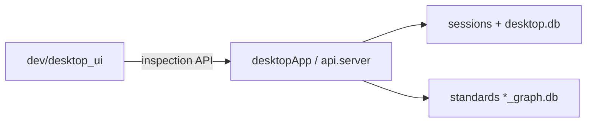

# dev/ — Architecture Audit

Audit date: 2026-07-05. Documentation reflects the code as it exists today; no architectural recommendations.

---

## Purpose

The `dev/` package is the **namespace for development-only tooling**. It is not imported by the production REST API ([`api/server.py`](../api/server.py)) and does not ship in release desktop bundles.

Desktop dev UI lives here today; root [`__init__.py`](__init__.py) is a docstring-only package marker.

---

## Tools at a glance

| Tool | Process model | Primary entry | User guide | Implementation audit |
|------|---------------|---------------|------------|----------------------|
| **Desktop dev UI** | In-process via `@dev-ui/*` lazy imports | `desktopApp npm run dev` (Dev badge) | [`docs/developer_inspection_framework.md`](../docs/developer_inspection_framework.md) | [`desktop_ui/README.md`](desktop_ui/README.md) |

Per-tool entry points, file inventories, dependencies, and execution traces live in the child README above — not duplicated here.

---

## Shared dev platform

Concerns common to dev debugging:

| Concern | Behavior |
|---------|----------|
| **Production boundary** | `api/` does not import `dev`. `desktop_ui` loads when `env.devToolsAvailable && devModeActive`. |
| **Shared read models** | Active task, `active_nodes`, compiled pack graphs (`GraphStore` / `*_graph.db`), optional `_execution_trace` on task outputs. |
| **Write policy** | Dev tools are **read-only** for engineering state (Inspector observes). |
| **Backend env flags** | `DEV_INSPECTION_ENABLED` (Electron dev sets this when unpackaged). |

---

## Who depends on `dev/`

Grep for `from dev.` / `import dev` / `@dev-ui` (2026-07-05):

| Consumer | Relationship |
|----------|--------------|
| `desktopApp/` | Imports `dev/desktop_ui` via `@dev-ui/*` (hover, inspector, node edit tab). |

**No imports from:** `api/`, `cli/`, or production `engine/` paths.

Docs referencing `dev/` (not runtime imports): `AGENTS.md`, `docs/developer_inspection_framework.md`, and per-folder audit READMEs under `config/`, `models/`, `storage/`, `scripts/`.

---

## Overlapping capabilities

Several graph surfaces overlap across dev tools and CLI. See [docs/audit/DUPLICATES.md — Graph visualization (dev)](../docs/audit/DUPLICATES.md#graph-visualization-dev) for the canonical map (Inspector graph panel vs CLI `graph show`).

No recommendation on which visualization to use; documented for navigation only.

---

## Child audits

| Folder | README | Audit status |
|--------|--------|--------------|
| `desktop_ui/` | [`desktop_ui/README.md`](desktop_ui/README.md) | Complete (2026-07-05) |
