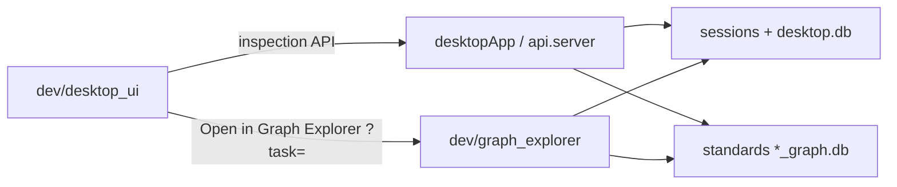

# dev/ — Architecture Audit

Audit date: 2026-07-05. Documentation reflects the code as it exists today; no architectural recommendations.

---

## Purpose

The `dev/` package is the **namespace for development-only tooling**. It is not imported by the production REST API ([`api/server.py`](../api/server.py)) and does not ship in release desktop bundles.

Two substantive tools live here today; root [`__init__.py`](__init__.py) is a docstring-only package marker.

---

## Tools at a glance

| Tool | Process model | Primary entry | User guide | Implementation audit |
|------|---------------|---------------|------------|----------------------|
| **Graph Explorer** | Separate Python + Vite (`:8765` / `:3000`) | `cd dev/graph_explorer && npm run dev` | [`docs/developer tools/developer_graph_explorer.md`](../docs/developer%20tools/developer_graph_explorer.md) | [`graph_explorer/README.md`](graph_explorer/README.md) |
| **Desktop dev UI** | In-process via `@dev-ui/*` lazy imports | `desktopApp npm run dev` (Dev badge) | [`docs/developer tools/developer_inspection_framework.md`](../docs/developer%20tools/developer_inspection_framework.md) | [`desktop_ui/README.md`](desktop_ui/README.md) |

Per-tool entry points, file inventories, dependencies, and execution traces live in the child READMEs above — not duplicated here.

---

## Shared dev platform

Concerns common to dev debugging across both tools:

| Concern | Behavior |
|---------|----------|
| **Production boundary** | `api/` does not import `dev`. Graph explorer web ships as a lazy `@graph-explorer` chunk. `desktop_ui` loads when `env.devToolsAvailable && devModeActive`. |
| **Shared read models** | Active task, `active_nodes`, compiled pack graphs (`GraphStore` / `*_graph.db`), optional `_execution_trace` on task outputs. |
| **Write policy** | Dev tools are **read-only** for engineering state (Graph Explorer and Inspector observe; Node Edit tab is the exception — writes via Dev Studio API, see [Node Dev Studio](../docs/node_dev_studio.md)). |
| **Backend env flags** | `DEV_INSPECTION_ENABLED`, `DEV_STUDIO_ENABLED` (Electron dev sets both when unpackaged). Graph Explorer runs as a separate server and needs no API flag. |
| **Session / user-data alignment** | Graph Explorer uses [`graph_explorer/explorer_config.py`](graph_explorer/explorer_config.py) to match Electron `DESKTOP_USER_DATA` when `GRAPH_EXPLORER_SESSION=auto`. Desktop dev UI uses the same backend the app already talks to. |
| **Cross-tool link** | Inspector Graph tab opens `http://localhost:3000?task=…` for deep subgraph view — see [`desktop_ui/inspector/InspectorGraphPanel.tsx`](desktop_ui/inspector/InspectorGraphPanel.tsx). |
| **Crash isolation** | Graph Explorer failure does not stop the desktop app (separate process and ports). |

---

## Who depends on `dev/`

Grep for `from dev.` / `import dev` / `dev.graph_explorer` / `@dev-ui` (2026-07-05):

| Consumer | Relationship |
|----------|--------------|
| `tests/dev/test_graph_explorer_*.py` | Imports `dev.graph_explorer` adapter and analysis modules. |
| `dev/graph_explorer/scripts/run-dev-server.mjs` | Spawns `python -m dev.graph_explorer`. |
| `desktopApp/` | Imports `dev/desktop_ui` via `@dev-ui/*` (hover, inspector, node edit tab). |

**No imports from:** `api/`, `cli/`, or production `engine/` paths (graph_explorer reads engine/storage APIs at runtime only).

Docs referencing `dev/` (not runtime imports): `AGENTS.md`, `docs/developer tools/`, `docs/node_dev_studio.md`, and per-folder audit READMEs under `config/`, `models/`, `storage/`, `scripts/`.

---

## Overlapping capabilities

Several graph and authoring surfaces overlap across dev tools, CLI, and Node Dev Studio. See [docs/audit/DUPLICATES.md — Graph visualization (dev)](../docs/audit/DUPLICATES.md#graph-visualization-dev) for the canonical map (Graph Explorer vs Inspector graph panel vs CLI `graph show`). Node authoring is owned by Node Dev Studio; Graph Explorer is read-only.

No recommendation on which visualization to use; documented for navigation only.

---

## Child audits

| Folder | README | Audit status |
|--------|--------|--------------|
| `graph_explorer/` | [`graph_explorer/README.md`](graph_explorer/README.md) | Complete (2026-07-05) |
| `desktop_ui/` | [`desktop_ui/README.md`](desktop_ui/README.md) | Complete (2026-07-05) |
