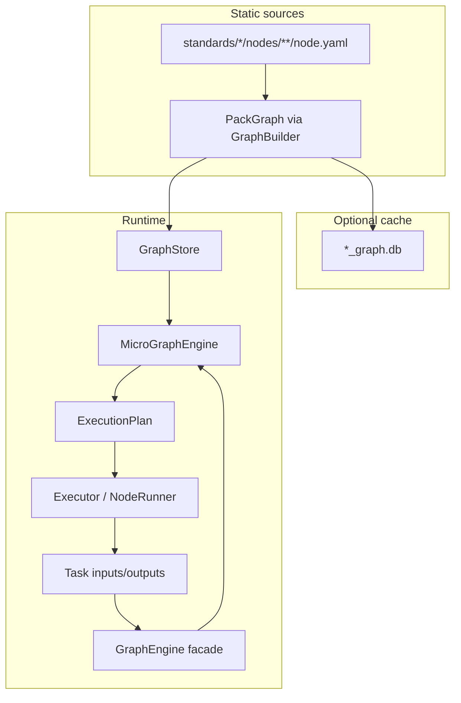
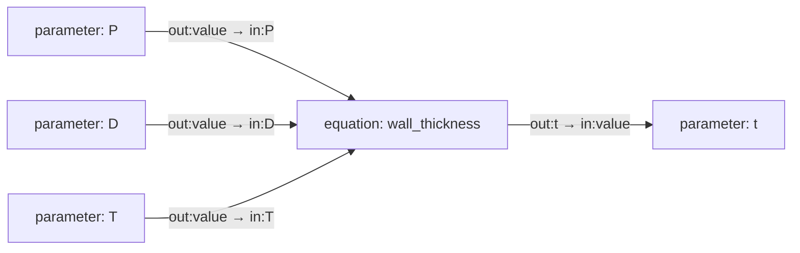
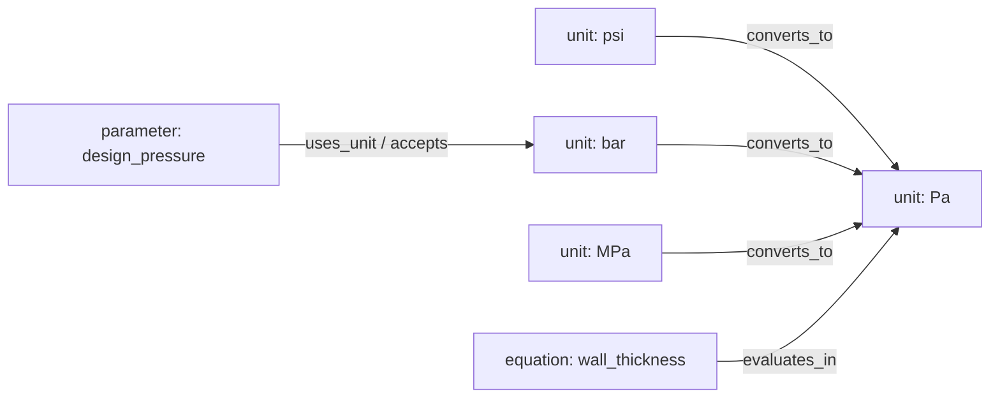
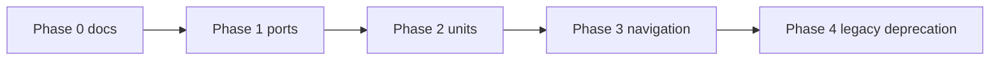

# Graph Architecture Review and Refactoring Plan

## Current architecture (audit summary)



**Strengths**
- Clear pipeline: **Markdown/YAML → GraphBuilder → PackGraph → optional SQLite cache** ([`engine/graph/graph_builder.py`](engine/graph/graph_builder.py), [`engine/reference/graph_cache.py`](engine/reference/graph_cache.py))
- Canonical 4-type model + `kind` metadata ([`engine/reference/node_types.py`](engine/reference/node_types.py)) — recent simplification aligns with ComfyUI/LangGraph “small node types, metadata variants”
- Conditional edges (`when`) + lazy expansion gate ([`engine/graph/lazy_expander.py`](engine/graph/lazy_expander.py)) — good for branching without mutating the source graph
- Static graph is not written at execution time; runtime values live on [`models/task.py`](models/task.py) `Task`
- Semantic edges compiled declaratively ([`engine/reference/graph_compile.py`](engine/reference/graph_compile.py))
- Dev tooling: Dev Studio authoring + Graph Explorer (React Flow) for dev-only DAG view

**Weaknesses**
- **Dual execution paths**: micro-graph (`MicroGraphEngine`) vs legacy `depends_on` traversal in [`engine/graph/graph_engine.py`](engine/graph/graph_engine.py) — duplicated behavior
- **Domain logic in graph layer**: hardcoded field lists in [`engine/graph/navigation_phases.py`](engine/graph/navigation_phases.py), B31.3 node IDs in [`engine/graph/parameter_registry.py`](engine/graph/parameter_registry.py), display logic in [`engine/graph/display_emitter.py`](engine/graph/display_emitter.py)
- **Implicit dataflow (being addressed)**: today via `input_id` / `symbol` / `requires` / `calculates` — Phase 1 introduces explicit ports
- **Scattered type checks**: repeated `node_type == "parameter"` across graph files instead of a small behavior registry
- **Units are not graph-native**: inline `unit: Pa` on parameters + hardcoded switch in [`engine/executor/unit_manager.py`](engine/executor/unit_manager.py) — blocks automatic multi-hop conversion and plugin extensibility
- **Visualization gaps**: no source-driven `display` metadata; explorer styles hardcoded in [`dev/graph_explorer/web/src/utils/nodeStyles.ts`](dev/graph_explorer/web/src/utils/nodeStyles.ts); production desktop has list-only relationships, no DAG
- **Task state mixing**: `task.outputs` holds planning + engineering results + traces; some paths mutate `Task` without [`engine/state/state_manager.py`](engine/state/state_manager.py)
- **Legacy monolithic `definition` nodes** still parallel to micro-graph ([`standards/.../node.md`](standards/asme/asme_b31.3/nodes/304/304.1/304.1.1/node.md))

---

## Comparison to best practices

| Principle | Current state | Gap |
|-----------|---------------|-----|
| Rich metadata | `id`, `type`, `kind`, `version`, `status`, `tags`, `defined_in`, `concept_id` partially present | Missing consistent `display`, `source`, `modified`; no versioned node schema |
| Explicit I/O ports | Implicit: `input_id` + `requires`/`calculates` edges | **Target: every node exposes `inputs` / `outputs` ports**; dataflow edges are port-to-port, not arbitrary semantic links |
| Static vs runtime | Good separation at graph level; plan rebuilt per input set | Shallow copy of `task.inputs` into `ExecutionPlan`; `parameter_registry` not persisted |
| Separation of concerns | Executor vs validator vs planner exist | Equation display + SymPy in graph layer; navigation hardcoded per workflow |
| Small composable nodes | Micro-graph direction is correct | Legacy definition nodes and thick `GraphEngine` facade remain |
| Generic graph engine | Substrate (store, traversal, compile) is generic | Orchestration layer is B31.3-specific |
| Extensibility | `kind` + edge keys; Dev Studio schemas | No handler registry; new behaviors require editing many `if type` sites |
| Browser visualization | Dev explorer only | No `display.icon/color/ports` in YAML; `kind` not reflected in styles |

---

## New design requirement: explicit ports on every node

### Node-type port conventions

| Type | Inputs | Outputs | Notes |
|------|--------|---------|-------|
| `parameter` | — (or `in:value` for calculated params) | `out:value` | `input_id` maps to task key for user-entered params |
| `equation` | `in:{symbol}` per formula variable | `out:{symbol}` per result | `priority` only on input ports |
| `unit` | — | `out:value` | Identity node; conversion via `converts_to` edges |
| `workflow` | `in:trigger` (optional) | `out:complete` (optional) | Phase 3+; control flow, not engineering values |
| `text` | — | — | Structural only; no data ports in Phase 1 |

Ports are a **cross-cutting abstraction** on canonical types — not a sixth node type.

### Problem today

Dataflow is expressed as **node-to-node semantic edges** (`requires`, `calculates`, `uses`, `outputs`) plus loose fields (`input_id`, `symbol`). The engine infers wiring:

```
B313-param-P  --requires-->  B313-eq-wall-thickness
```

This is hard to visualize (React Flow / ComfyUI style), hard to extend with plugins, and mixes **structure** (contains, explains) with **dataflow** (values flowing into equations).

### Target model (Node-RED / ComfyUI / Blueprints)

Every node declares **named ports**. Connections are always **port → port**:



Example MAWP path:

```
Pressure ----\
Temperature --+--> Equation --> MAWP
Diameter -----/
```

Each leg is a **port connection**, not a generic `uses` or `requires` edge.

### Port schema (YAML)

```yaml
# parameter (value source)
id: B313-param-P
type: parameter
symbol: P
input_id: design_pressure
ports:
  outputs:
    - id: value          # canonical output port for all parameters
      dtype: pressure    # quantity kind (links to unit/dimension graph)
      unit: UNIT-Pa      # canonical unit node id (see unit graph section)

# equation (transform)
id: B313-eq-wall-thickness
type: equation
ports:
  inputs:
    - id: P
      dtype: pressure
      priority: 40       # collection order — ONLY on equation input ports
    - id: D
      dtype: length
      priority: 50
    - id: S
      dtype: pressure
      priority: 60
  outputs:
    - id: t
      dtype: length

connections:
  - from: { node: B313-param-P, port: value }
    to:   { node: B313-eq-wall-thickness, port: P }
  - from: { node: B313-eq-wall-thickness, port: t }
    to:   { node: B313-param-t, port: value }
```

**Backward compatibility:** [`graph_compile.py`](engine/reference/graph_compile.py) continues to accept legacy `requires` / `calculates` and **lowers** them to port connections at compile time:

| Legacy | Compiled port edge |
|--------|------------------|
| `equation.requires: [{ node_id: B313-param-P, priority: 40 }]` | `B313-param-P:out:value` → `equation:in:P` (symbol from param `symbol` field) |
| `equation.calculates: [B313-param-t]` | `equation:out:t` → `B313-param-t:in:value` |
| `lookup.keys: [material, design_temperature]` | key params `out:value` → `lookup:in:material` etc. |

Semantic / structural edges **remain** but are not used for value routing:

| Edge type | Purpose |
|-----------|---------|
| `contains`, `anchors_to`, `defines`, `explains` | Structure, UI, navigation |
| `converts_to` | Unit graph only |
| `next_step` + `when` | Branching / expansion |
| **port connections** | **All numeric/value dataflow** |

### Engine changes (generic layer)

New types in [`models/graph.py`](models/graph.py):

```python
@dataclass(frozen=True)
class Port:
    id: str
    direction: Literal["input", "output"]
    dtype: str | None = None          # pressure, length, dimensionless, ...
    priority: int | None = None       # input ports on equations only
    unit_node_id: str | None = None   # optional link to UNIT-*

@dataclass(frozen=True)
class PortConnection:
    from_node: str
    from_port: str
    to_node: str
    to_port: str
    metadata: dict[str, Any] = field(default_factory=dict)
```

[`PackGraph`](engine/graph/pack_graph.py) gains:
- `ports: dict[str, list[Port]]` per node (or ports embedded in node metadata after compile)
- `port_connections: list[PortConnection]` parallel to semantic edges

**Generic graph engine responsibilities** (engineering-agnostic):
1. Traverse **port graph** for execution order (topo-sort on port dependencies)
2. Resolve **port values** from `Task.inputs` / `Task.outputs` keyed by `(node_id, port_id)` or legacy `input_id` alias
3. Emit port definitions for visualization (positions, labels, dtypes)

**Engineering-specific** (stays in node runners / sympy / lookup):
- How to evaluate an `equation` node given filled input ports
- How to resolve a `parameter` + `kind: lookup`

### Visualization and plugins

Ports become the **single hook** for:
- React Flow handles ([`dev/graph_explorer`](dev/graph_explorer/)): render `inputs` left, `outputs` right
- Dev Studio relationship panel: show port names, not only edge types
- Future plugins: register `(type, kind)` handler + port schema without editing traversal core

### Relationship to units-as-nodes

Units attach to **ports**, not to whole nodes:

```
parameter P                    unit node
  out:value (dtype: pressure) ---- unit: UNIT-Pa
  out:unit   (optional)     ---- UNIT-psi (user's entered unit)
```

Conversion path: `UNIT-psi --converts_to--> UNIT-Pa` applied when binding `in:P` on the equation.

---

## New design requirement: units as graph nodes

### Today (to replace incrementally)

```yaml
# B313-param-P/node.yaml
unit: Pa
```

Conversion is imperative in [`engine/executor/unit_manager.py`](engine/executor/unit_manager.py) (`psi` → `Pa` via constants). Validation uses `allowed_units` lists in [`engine/validation/unit_validator.py`](engine/validation/unit_validator.py).

### Target model



**Design decisions (recommended)**

1. **Fifth canonical type: `unit`** (not `parameter` + kind) — units are not engineering quantities; they are conversion vertices. Keeps the generic engine’s type set small but distinct.
2. **Global unit ontology pack** — `standards/units/` (or `standards/_global/units/`) separate from ASME B31.3 content so all packs share one conversion graph.
3. **Parameter links to unit nodes** — replace inline `unit:` with:
   ```yaml
   canonical_unit: UNIT-Pa          # SI/canonical for this quantity
   accepts_units: [UNIT-psi, UNIT-bar, UNIT-MPa, UNIT-Pa]  # optional; default = reachable via converts_to
   dimension: pressure              # optional grouping for viz
   ```
4. **Equation declares evaluation unit** — per **input port** `dtype` + `unit` on the port definition (or derived from connected parameter’s `out:value` port).
5. **Runtime conversion = graph walk** — new `engine/units/unit_graph.py`:
   - Load unit nodes + `converts_to` edges (with `factor`, `offset` metadata on edge)
   - `convert_value(value, from_unit_id, to_unit_id)` → path multiply (BFS on unit DAG)
   - Replace body of `convert_to_si()` with graph resolution to canonical SI unit nodes
6. **Backward compatibility** — at compile time, `unit: Pa` string → resolve/create alias to `UNIT-Pa`; deprecate string field in templates over 2 phases.

**What stays in runtime state**
- `EngineeringInput` still stores **user’s chosen unit id** (or symbol string during migration) and **numeric value** — graph defines how to convert, not task YAML.

**Intentionally not in phase 1**
- Full UCUM / Pint integration — graph-native conversion is enough for MVP
- Unit nodes for **dimensionless** quantities (use sentinel `UNIT-dimensionless`, no edges)

---

## Phased refactoring (execute only after approval)

### Phase 0 — Documentation and guardrails (no behavior change)
- Add [`docs/architecture/graph_platform.md`](docs/architecture/graph_platform.md): static/runtime boundary, canonical types, **port model**, unit graph design
- Add [`docs/node-templates/ports.md`](docs/node-templates/ports.md): port naming (`value`, symbol ids), `connections` block, legacy lowering rules
- Extend [`docs/node-templates/parameter.md`](docs/node-templates/parameter.md): `ports.outputs`, `canonical_unit` on port; mark bare `unit:` deprecated
- Add [`docs/node-templates/unit.md`](docs/node-templates/unit.md): unit node template

### Phase 1 — Port model (foundational refactor)
- Add `Port`, `PortConnection` to [`models/graph.py`](models/graph.py)
- Add [`engine/graph/port_compile.py`](engine/graph/port_compile.py): lower `requires`/`calculates`/`keys` → port connections; validate port ids unique per node
- Extend [`GraphBuilder`](engine/graph/graph_builder.py) to populate `PackGraph.port_connections`
- Add [`engine/graph/port_graph.py`](engine/graph/port_graph.py): topo-sort and neighbor queries on port connections only
- **Executor**: build symbol map from port connections instead of scanning `requires` lists ([`engine/executor/node_runner.py`](engine/executor/node_runner.py))
- **Priority**: read `priority` from equation **input port** metadata only ([`engine/graph/param_priority.py`](engine/graph/param_priority.py) — align with recent rule: no priority on parameter nodes)
- **Explorer / Dev Studio**: render port handles; list connections as `node:port → node:port`
- Tests: compile legacy YAML unchanged behavior; explicit `connections` block round-trip

### Phase 1b — Low-risk structural wins (parallel)
- **Node behavior registry** ([`engine/graph/node_behaviors.py`](engine/graph/node_behaviors.py)): map `(type, kind)` → predicates used by expander, executor skip rules, display — collapse scattered checks without new node types
- **Task state hygiene**: route coefficient lookup / definition-equation writes through `TaskStateManager`; split `planning_summary` key convention (document only, no API break)
- **Visualization metadata** (optional YAML block, ignored by engine until used):
  ```yaml
  display:
    label: Design pressure
    category: inputs
    icon: gauge
    color: blue
  ```
  Expose via Dev Studio API + fix explorer to style by `type` + `kind` ([`dev/graph_explorer/web/src/utils/nodeStyles.ts`](dev/graph_explorer/web/src/utils/nodeStyles.ts))

### Phase 2 — Unit graph (depends on port model)
- Add `unit` to [`CANONICAL_NODE_TYPES`](engine/reference/node_types.py)
- Unit nodes expose `ports.outputs: [value]` with `dtype`; `converts_to` edges carry `{ factor, offset? }`
- Parameters: `ports.outputs[0].unit: UNIT-Pa` instead of top-level `unit:`
- [`engine/units/unit_resolver.py`](engine/units/unit_resolver.py) walks unit graph; applied at **port bind** time when connecting user input unit to equation input port
- Migrate B31.3 parameters (14 files)
- Tests: psi→Pa via unit graph; port bind with mismatched dtype rejected

### Phase 3 — Declarative navigation (reduce hardcoding)
- Move phased field order from [`engine/graph/navigation_phases.py`](engine/graph/navigation_phases.py) into workflow node metadata (`phases: [{ id, fields }]`)
- Retire [`engine/graph/parameter_registry.py`](engine/graph/parameter_registry.py) legacy path when micro-graph registry is sufficient

### Phase 4 — Legacy path deprecation
- Feature-flag legacy `GraphEngine._collect_nodes`; micro-graph only when `GraphStore.available`
- Migrate remaining `definition` / `calculation` node.md execution to micro-graph equations

### Intentionally NOT doing (unless requirements change)
- Neo4j or external graph DB migration
- Production React Flow DAG in desktop app (keep explorer dev-only until product asks)
- Plugin dynamic loading / DLL architecture
- Rewriting engineering formulas or standards content
- Cosmetic renames across the repo
- **Dual port + semantic dataflow forever** — semantic `requires`/`calculates` are a **compile-time authoring convenience** only; runtime uses port graph exclusively after Phase 1

---

## Report template (deliverable after execution)

When phases are implemented, produce:

1. **Existing strengths** — compile pipeline, lazy expansion, 4+1 types, task/graph split
2. **Weaknesses** — dual paths, hardcoded navigation, implicit dataflow (addressed in Phase 1 ports)
3. **Improvements made** — per phase, with file list
4. **Improvements intentionally not made** — Neo4j, production DAG, dynamic plugins
5. **Future improvements** — AI reasoning on port events, plugin handler registration, persisted `parameter_registry`
6. **Compatibility risks** — legacy edge lowering, `unit:` deprecation, cache invalidation
7. **Suggested next steps** — Phase 0 docs → Phase 1 ports → Phase 2 units

---

## Compatibility risks

| Risk | Mitigation |
|------|------------|
| Legacy `requires` / `calculates` YAML | Compile-time lowering to port connections; no author rewrite required initially |
| `EngineeringInput` keyed by `input_id` | Maintain alias map: `input_id` ↔ `(param_node, out:value)` during migration |
| Existing YAML `unit: Pa` | Move to `ports.outputs[0].unit: UNIT-Pa`; compile-time alias |
| Hardcoded `convert_to_si` | Unit resolver at port bind; legacy table fallback |
| Dev Studio / explorer | Extend serializers with `ports` + `connections`; explorer renders handles |
| Cache fingerprint | Rebuild graph DB after port compile changes |

---

## Suggested execution order



**Recommended first batch:** Phase 0 + Phase 1 (port model with legacy lowering). Phase 2 (units) builds on ports. Phase 1b (viz metadata, behavior registry) can run in parallel with Phase 1.
