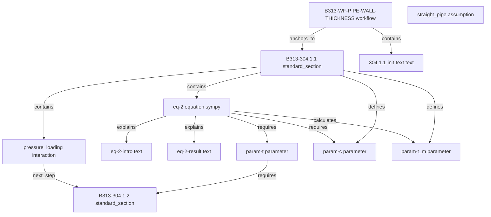
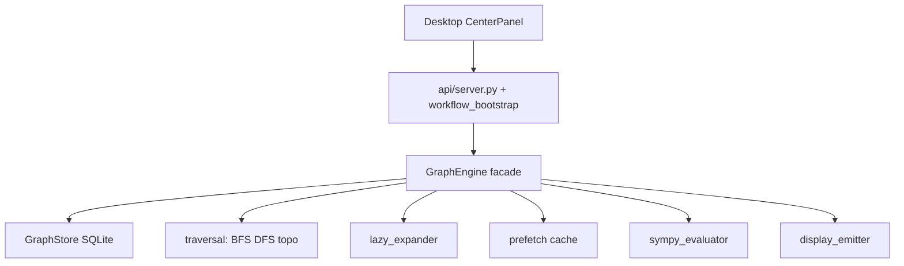

# Node Graph Redesign Implementation Plan

## Goal

Implement [docs/node design.md](docs/node%20design.md): **graph traversal is the only navigation path**. Workflows are defined by root/workflow nodes (not `standards/tasks/*/root.md`). The central panel content (text, equations, symbol tables, substitutions, results) is emitted by traversing micro-nodes—not hardcoded in [api/workflow_timeline.py](api/workflow_timeline.py), [engine/planner/planner.py](engine/planner/planner.py), or per-workflow bootstrap logic.

You chose **foundation-first** + **full micro-graph from the start**.

---

## Proposed Node Configuration (for review before coding)

### Node types (one template each in `docs/node-templates/`)

|   |   |   |
|---|---|---|
|Type|Role|Key fields|
|`workflow`|Task entry / calculator (replaces `root.md`)|`title`, `anchors_to` (standard section), `goal_output` (param node id), `report`|
|`standard_section`|Paragraph anchor (e.g. `B313-304.1.1`)|`paragraph`, `section`, `revision_year`|
|`text`|Initiation text, explanations, captions|`role`: `initiation` \| `equation_intro` \| `result_explanation` \| `caption`|
|`equation`|Pure math|`sympy`, `display_latex`, `requires` (param ids), `calculates` (param ids)|
|`parameter`|Symbol + resolution|`symbol`, `input_id`, `unit`, `priority`, `resolution` (user_input / table_lookup / equation), `question`, `references`|
|`table`|Table reference node|`table_id`, `standard`, `lookup_keys`|
|`assumption`|Expansion prerequisite|`field`, `required_for_expansion`, `allowed_values`, `blocks_expansion_on`, `question`|
|`interaction`|Path decision (internal vs external pressure)|`field`, `mode`, `options`, `required_for_expansion`, `question`|
|`lookup`|Executable table resolution|`table_id`, `keys`, `output_param`|

### Semantic edges (`models/graph.py`)

Extend `EdgeType` to include (minimum set for v1):

- `requires`, `calculates`, `references`, `defines`, `explains`, `outputs`, `contains`, `anchors_to`, `uses_table`, `next_step`, `validates`, `located_in`
    

Legacy `depends_on` in YAML compiles to typed edges at build time.

### Example micro-graph for pipe wall thickness



### Equation nodes (sympy-only execution)

Per your spec, equation nodes store **only**:

```yaml
id: B313-eq-2
type: equation
sympy: "t_m = t + c"
display_latex: "t_m = t + c"
requires: [B313-param-t, B313-param-c]
calculates: [B313-param-t_m]
```

- Human-readable body in linked `text` nodes (`equation_intro`, `result_explanation`).
    
- Symbol table rows are `parameter` nodes linked via `defines` / `references`.
    
- **No `execution_function`** in equation nodes; sympy substitution in new `engine/equation/sympy_evaluator.py`.
    
- Table lookups and conditional resolution remain graph traversals ending in `lookup` nodes; sympy runs only after all `requires` params are resolved.
    

### Workflow root model

- Remove [standards/tasks/asme_b31.3/pipe_wall_thickness_design/root.md](standards/tasks/asme_b31.3/pipe_wall_thickness_design/root.md) and [mawp_design/root.md](standards/tasks/asme_b31.3/mawp_design/root.md).
    
- Add `type: workflow` nodes:
    
    - `B313-WF-PIPE-WALL-THICKNESS` → `anchors_to: B313-304.1.1`, `goal_output: B313-param-t_m`
        
    - `B313-WF-MAWP` → anchors to MAWP section nodes
        
- Task creation uses workflow node id; standards paragraph remains discoverable separately for browse/search.
    

---

## Architecture (target)



**Rule:** API, planner, executor, and UI never read markdown or SQLite node tables directly—only `GraphEngine`.

---

## Phase 1 — Foundation (no user-visible cutover yet)

### 1.1 Node templates + Cursor rule

- Create `docs/node-templates/` copies: `workflow.md`, `standard_section.md`, `text.md`, `equation.md`, `parameter.md`, `table.md`, `assumption.md`, `interaction.md`, `lookup.md`.
    
- Add [.cursor/rules/node-creation.mdc](.cursor/rules/node-creation.mdc): when adding paragraph/formula/table content, read templates first; ask before adding new template fields.
    

### 1.2 Graph storage schema

Extend build pipeline ([scripts/build_standards_nodes_db.py](scripts/build_standards_nodes_db.py)) or add `scripts/build_graph_db.py`:

- New tables in pack DB (or `graph.db` per pack):
    
    - `graph_nodes(id, type, metadata_json, body)`
        
    - `graph_edges(from_id, to_id, edge_type, metadata_json)`
        
- Compile micro-node YAML/markdown from `standards/asme/asme_b31.3/graph/nodes/**/node.yaml`.
    
- Compile edges from explicit `edges:` blocks **and** legacy `depends_on` / `nomenclature` / `equations` in paragraph nodes during migration.
    

### 1.3 GraphEngine rewrite

New modules under [engine/graph/](engine/graph/):

|   |   |
|---|---|
|Module|Responsibility|
|`graph_store.py`|Load nodes/edges from compiled DB; in-memory adjacency index|
|`traversal.py`|`bfs_neighbors(id, depth, edge_filter)`, `dfs_path(root, inputs)`, `topological_order(subgraph)`|
|`lazy_expander.py`|Expand only frontier nodes for current step (not full DAG on task open)|
|`prefetch.py`|Background expand next 1–2 parameter/equation nodes while user inputs current field|
|`display_emitter.py`|Ordered `display_outputs` blocks from text/equation/parameter nodes|
|`graph_engine.py`|Public facade: `get_neighbors`, `resolve_next_step`, `build_execution_plan`, `emit_active_context`|

Extend [models/graph.py](models/graph.py) with full `EdgeType` enum.

### 1.4 Sympy evaluator

- Add `sympy` dependency (not currently in repo).
    
- `engine/equation/sympy_evaluator.py`: parse `sympy` expr, map parameter node `input_id` values, substitute, evaluate, format substitution strings matching current [desktopApp/src/components/engineering/NodeCalculationGroup.tsx](desktopApp/src/components/engineering/NodeCalculationGroup.tsx) output shape.
    
- Unit tests for `t_m = t + c` and `t = P*D/(2*(S*E*W + P*Y))`.
    

---

## Phase 2 — Micro-node content migration (pipe wall thickness first)

Decompose existing [standards/asme/asme_b31.3/nodes/304/304.1/304.1.1/node.md](standards/asme/asme_b31.3/nodes/304/304.1/304.1.1/node.md) into ~40 micro-nodes:

- 1 `workflow`, 1 `standard_section`
    
- 2 `assumption` + 1 `interaction` (from current `assumptions` / `interactions`)
    
- 1 `text` initiation (from `display_heading` + purpose)
    
- Per nomenclature symbol: 1 `parameter` node (c, D, P, S, E, W, Y, t, t_m, …) with `priority`, `resolution`, `references`
    
- `eq-2` equation node + intro/result text nodes
    
- Conditional edges to `B313-304.1.2` / `B313-304.1.3` via `interaction` → `next_step`
    
- Table references as `table` nodes (`B313-table-A-1`, etc.)
    

Repeat for `304.1.2`, lookup nodes, and coefficient tables on the internal-pressure path.

**Keep old `node.md` files temporarily** as migration reference; build script ignores them once graph nodes exist (or mark `status: superseded`).

---

## Phase 3 — Engine + API cutover (single migration)

### Remove hardcoded workflow logic

|                                                                  |                                                                                                                                         |
| ---------------------------------------------------------------- | --------------------------------------------------------------------------------------------------------------------------------------- |
| File                                                             | Change                                                                                                                                  |
| [api/workflow_timeline.py](api/workflow_timeline.py)             | Delete per-workflow phase/order constants; derive timeline from `topological_order` + parameter `priority`                              |
| [engine/planner/planner.py](engine/planner/planner.py)           | Remove `_INPUT_QUESTIONS`, `_DEFAULT_PRIORITIES`; questions from `parameter`/`assumption`/`interaction` nodes                           |
| [api/workflow_bootstrap.py](api/workflow_bootstrap.py)           | Replace `preview_plan` full traversal with `resolve_next_step` + optional `prefetch`; target **< 1s** first prompt                      |
| [api/serializers.py](api/serializers.py)                         | `WORKFLOW_CATALOG` from `GraphEngine.list_workflows()` (type=workflow nodes)                                                            |
| [engine/router.py](engine/router.py)                             | Map slugs to workflow node ids                                                                                                          |
| [engine/executor/node_runner.py](engine/executor/node_runner.py) | Execute via graph: equation → sympy; lookup → existing [lookup_engine.py](engine/executor/lookup_engine.py) triggered by `lookup` nodes |
| [engine/executor/functions.py](engine/executor/functions.py)     | Deprecate formula functions used only for sympy-replaceable math                                                                        |

### Delete task-root layer

- Remove `standards/tasks/**/root.md` and [scripts/build_standards_tasks_db.py](scripts/build_standards_tasks_db.py) usage for workflows.
    
- Update [engine/reference/standards_reader.py](engine/reference/standards_reader.py): `load()` delegates to `GraphStore`; keep table DB access internal to GraphEngine.
    

### Display pipeline

- [api/node_context.py](api/node_context.py) + [api/node_calculation_summaries.py](api/node_calculation_summaries.py) consume `display_emitter` output (no workflow-specific branches).
    
- Desktop app unchanged in principle—still renders `display_outputs` blocks—but verify [buildWorkflowHistory.ts](desktopApp/src/components/workflow/buildWorkflowHistory.ts) handles new block types if any.
    

---

## Phase 4 — MAWP + second workflow cutover

- Create `B313-WF-MAWP` workflow node + micro-nodes for MAWP path (reuse shared parameter nodes where symbols overlap, e.g. `B313-param-S`).
    
- Remove MAWP-specific constants in [engine/graph/navigation_phases.py](engine/graph/navigation_phases.py).
    

---

## Phase 5 — Performance + search hooks

- **Lazy expansion:** task open loads workflow node + first assumption/interaction only.
    
- **Prefetch:** after rendering current composer field, async `GraphEngine.prefetch(horizon=1)`.
    
- **BFS API:** `GET /api/v1/graph/neighbors?nodeId=&depth=` for future sidebar / search (per doc’s “Related Concepts”).
    
- Update [tests/mvp/test_performance.py](tests/mvp/test_performance.py) target from `< 10s` to `< 1s` for first-step resolution.
    

---

## Testing strategy

- New: `tests/graph/test_graph_store.py`, `test_traversal.py`, `test_lazy_expander.py`, `test_sympy_evaluator.py`, `test_display_emitter.py`
    
- Update: [tests/graph/test_graph_engine.py](tests/graph/test_graph_engine.py), [tests/acceptance/test_graph_and_planner.py](tests/acceptance/test_graph_and_planner.py), [tests/mvp/test_deterministic_and_graph_regression.py](tests/mvp/test_deterministic_and_graph_regression.py)
    
- End-to-end: [tests/mvp/test_desktop_mvp_workflow.py](tests/mvp/test_desktop_mvp_workflow.py) + `cd desktopApp && npm run verify:mvp`
    
- Rebuild DBs: `python scripts/build_all_standards_dbs.py` after graph schema changes
    

---

## Risks and mitigations

|   |   |
|---|---|
|Risk|Mitigation|
|Large node count (~500+ for B31.3 pipe path)|Compiled SQLite + adjacency index; lazy expansion|
|Sympy cannot express conditional Y (thin vs thick wall)|Conditional `equation` nodes with `when:` edges; graph picks active equation node|
|Foundation-first cutover breaks MVP mid-build|Feature flag `USE_MICRO_GRAPH=1` until Phase 3 tests pass|
|Unit handling in sympy|Reuse [unit_manager.py](engine/executor/unit_manager.py) before/after sympy eval|
|Template churn|Cursor rule + confirm new fields before codegen|

---

## Success criteria

1. Create task from `B313-WF-PIPE-WALL-THICKNESS`; first user prompt appears in **< 1s**.
    
2. No references to `pipe_wall_thickness_design` slug or `standards/tasks/` in runtime path.
    
3. Central panel content for t_m calculation comes entirely from graph traversal (text → equation intro → symbol table → substitution → result explanation).
    
4. `python -m pytest tests/api tests/graph tests/mvp` and `npm run verify:mvp` pass after cutover.
    
5. Node templates live in `docs/node-templates/`; Cursor rule enforces template-first authoring.
    

---

## Suggested implementation order (todos)

Foundation before any workflow cutover; pipe wall micro-nodes before MAWP; tests updated at each layer.