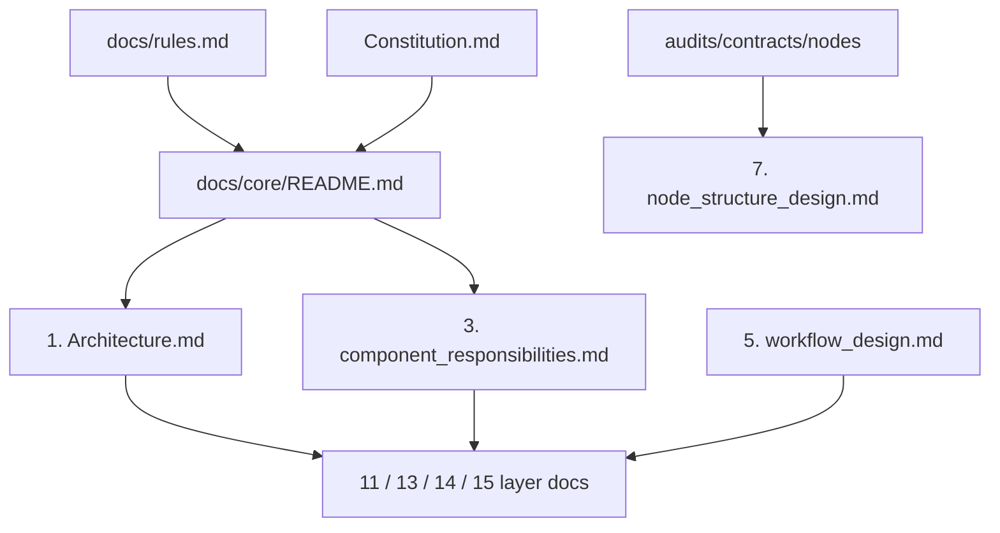

# Core design documentation index

> **Category:** `EXPLANATORY_DOCUMENTATION` per [`docs/rules.md`](../rules.md) §Documentation authority. These files explain design; they do not override policy, contracts, or code.

## Read this first

| Priority | Source | Role |
| --- | --- | --- |
| 1 | [`docs/rules.md`](../rules.md) | Agent policy, layer boundaries, graph paths, prompts, Flow Guidance |
| 2 | [`audits/contracts/nodes/00-START-HERE.md`](../../audits/contracts/nodes/00-START-HERE.md) | Node authoring |
| 3 | [`docs/architecture/Constitution.md`](../architecture/Constitution.md) | Architectural laws |
| 4 | This folder | Narrative design reference |

Implementation truth: [`docs/audit/INDEX.md`](../audit/INDEX.md) and per-package `**/README.md` audits.

---

## Document map

| Document | Use when you need… |
| --- | --- |
| [`1. Architecture.md`](1.%20Architecture.md) | Repo layout, workflows/knowledge paths, one end-to-end lifecycle diagram |
| [`3. component_responsibilities.md`](3.%20component_responsibilities.md) | **Canonical** layer boundary diagram and owns/must-not-own tables |
| [`5. workflow_design.md`](5.%20workflow_design.md) | Runtime phases, `TaskStatus` vs `NavigationPhase`, input collection |
| [`6. ai_agent_design.md`](6.%20ai_agent_design.md) | LLM vs deterministic agent boundaries |
| [`7. node_structure_design.md`](7.%20node_structure_design.md) | Short node-model summary → contracts for authoring |
| [`10. report_generation_design.md`](10.%20report_generation_design.md) | Report pipeline (Flow Guidance is **not** in this path) |
| [`11. planner_layer_design.md`](11.%20planner_layer_design.md) | Planner-specific behavior |
| [`13. execution_layer_design.md`](13.%20execution_layer_design.md) | Executor / resolved `ExecutionPlan` contract |
| [`14. graph_engine_design.md`](14.%20graph_engine_design.md) | Graph expansion, active subgraph, conditions |
| [`15. validation_layer.md`](15.%20validation_layer.md) | Validation timing, compliance gate, overrides |
| [`16. task_outputs_authority.md`](16.%20task_outputs_authority.md) | Which `task.outputs` keys are authoritative |
| [`../architecture/ontology architecture.md`](../architecture/ontology%20architecture.md) | Conceptual ontology (Parameter, Fact, Goal, …) |
| [`../architecture/Principles.md`](../architecture/Principles.md) | Teaching appendix — Constitution is normative |

**Runtime models:** [`models/README.md`](../../models/README.md), [`docs/desktopApp/07_frontend_data_models.md`](../desktopApp/07_frontend_data_models.md).

---

## Single-source rules (do not duplicate elsewhere)

| Topic | Canonical home | Other docs may only… |
| --- | --- | --- |
| Layer boundaries | `3. component_responsibilities` + `rules.md` §12–13, §21 | Link |
| End-to-end lifecycle | `1. Architecture` (one diagram) | Link |
| Graph expansion | `rules.md` §13 + `14. graph_engine` | No full re-list |
| Condition ownership | `rules.md` + `15. validation` + `14. graph` | One sentence + link |
| Status vocabularies | `5. workflow_design` §2 + `models/task.py` | No duplicate enum tables |
| Node authoring | `audits/contracts/nodes/*` | `7` = summary only |
| Overrides / lookup-derived | `rules.md` §16 + `15. validation` | Link only |
| Report vs Flow Guidance | `10. report_generation` + `rules.md` §21 | State once |
| Task output authority | `16. task_outputs_authority` | Link only |

---

## Banner for other `docs/core/*.md` files

Every file in this folder is explanatory. When a topic has a canonical home in the table above, link there instead of copying the full explanation.
